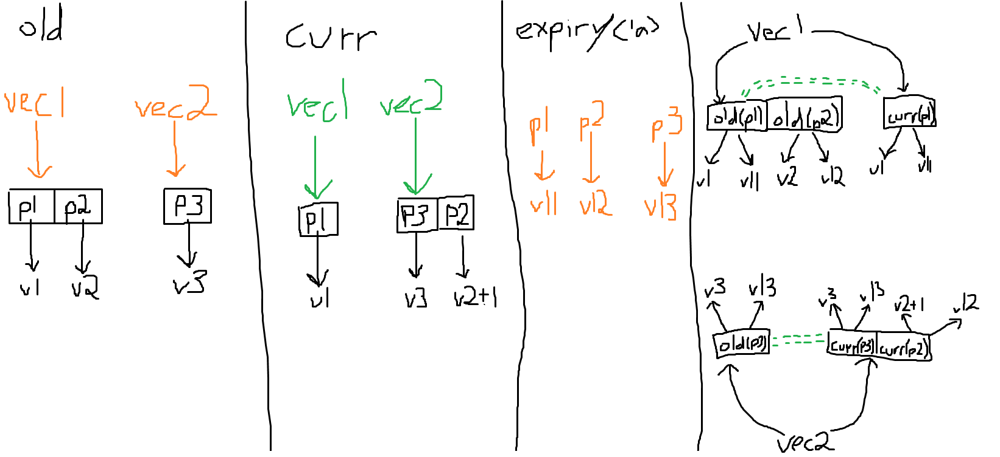
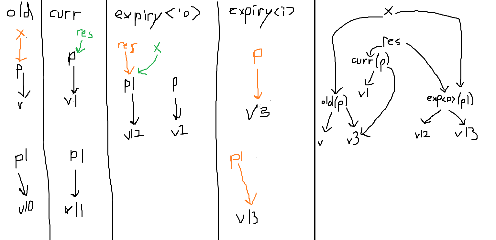
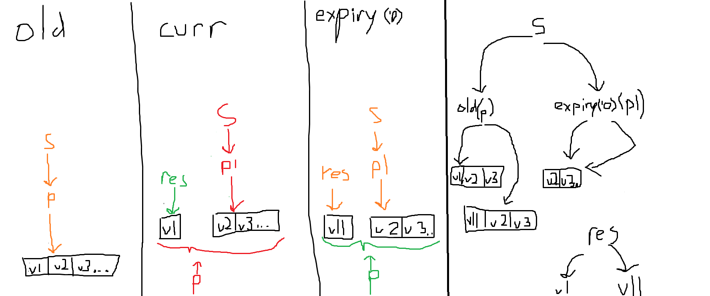

## Prusti syntax to Creusot syntax
```


'a := Arbitrary Lifetime
'c := Lifetime of the call
exp := Rust Expression
exp_ref := Rust Expresion with type &_
exp_mut<'a> := Rust Expresion with type &'a mut _
pearlite_exp := Pearlite Expression
pearlite_exp_mut<'a> := Pearlite Expresion with type &'a mut _
field := Rust Field
pat := Rust Pattern
lit := Rust Literal
id := Rust Identifier

f := Rust Function (Assume methods calls have already been desugared)
ts := old | expiry<'a>
curr <=> expiry<'c> // these can be used interchangably
(Time slice)


#[requires(exp)] => #[cruesot_requires(at_ts(old, exp))]
#[ensures(exp)] => #[creusot_ensures(at_ts(curr, exp))]
#[after_expiry<'a>(exp)] => #[creusot_ensures(at_ts(after_expiry<'a>, exp))]

at_ts: ts, exp -> pearlite_exp | Compile Error

at_ts(ts, old(exp)) => at_ts(old, exp)
at_ts(expiry<'a>, before_expiry(exp)) => at_ts(expiry<'a>, exp) // Not nessicary
at_ts(ts, before_expiry(exp)) => Compile Error
at_ts(ts, f(exp...)) => f(at_ts(ts, exp)...)
// Constructors can be though of like functions
at_ts(ts, exp.field) => at_ts(ts, exp).field 
// note getting a field from a mutable refererence should be desugared to (*exp).field
at_ts(ts, match exp1 {(pats => exps)...}) => match at_ts(ts, exp) {(pats => at_ts(ts, exps) ...)}
// If and let can be thougt of like match
at_ts(ts, lit) => lit
at_ts(ts, *exp_ref) => *at_rs(exp_ref)
as_ts(ts, *exp_mut) => deref_at_ts(ts, at_ts(ts, exp_mut), home(ts, exp_mut))
// Note coercing a mutable reference to a shared reference counts as derefrencing
as_ts(ts, id) => id

home: ts, exp -> set ts

home(ts, lit) -> {}
home(ts, param) -> {old}
home(ts, result) -> {curr}
home(ts, id) -> //polarity of the type id was bound to
home(ts, pearlite_exp.field) -> home(pearlite_exp)
home(ts, match exp1 {(pats => exps)...}) => union(polarity(exps...))
home(ts, old(exp) -> home(old, exp)
home(ts, *exp) -> ts
home(ts, f(exp...)) -> {old, curr} // This could also be improved by inlining and/or paramatricity tricks


deref_at_ts: ts, pearlite_exp_mut, home -> pearlite_exp | Compile Error
deref_at_ts(expiry<'a>, pearlite_exp_mut<'a>, {expiry<'a>}}) => *pearlite_exp_mut 
// ~^ This could go either way as these *pearlite_exp_mut should be known equal to ^pearlite_exp_mut
deref_at_ts(ts, pearlite_exp_mut, {ts}) => *pearlite_exp_mut
deref_at_ts(expiry<'a>, pearlite_exp_mut<'a>, {tss, ...}) => ^pearlite_exp_mut
deref_at_ts(ts, *exp, polarity) => Compile Error
```

TODO: Find method of determining which mutable references are known to have `*x == ^x` purely from the signature
(this is true when their `home` is `expiry<'a>` where `'a` is their lifetime).
These equalities should be added as premises to the all the postconditions.

TODO: Better handle calling logic/pure functions with a "home signature"
 * This would need to describe the expected homes of the parameters eg.
   * Home must be the expriy of a given lifetime parameter
   * Home must match the time slice the function is called in
   * Home doesn't matter (we will never dereference this)
 * It would also need to list which parameters may contribute to the home of the return value
 * Could look something like:

 ```rust
#[logic(('curr) -> 'curr)]
fn stubs::cur<T>(x: &mut T) -> T {
    *x // Translates to Cruesot *x
}

#[logic(('_) -> 'curr)]
fn stubs::fin<'curr, T>(x: &'curr mut T) -> T {
    *x // Translates to Cruesot ^x
}

#[logic(<'x>('x) -> 'x), where 'curr: 'x]
fn force_cur<'a, T>(x: &'a mut T) {
    expiry::<'x>(*x)
}

#[logic(('_) -> 'a)]
fn force_fin<'a, T>(x: &'a mut T) {
    expiry::<'a>(*x) // This would probably be a step forward (is this allowed?)
}


#[logic(('_, '_) -> '!)] // '! means that the home is meaningless (subtype of everything)
fn eq<X>(x: X, y: X) -> bool {
    x == y
}

#[logic(('curr) -> 'curr)] // Allow &mut to implement model
fn model(self) -> Self::ModelTy;

#[logic(<'x>('x, '_, '_) -> '!), where 'curr: 'x]
fn postcondtion_mut<'curr, F: FnMut(Args) -> Out, Args, Out>(f: &'curr mut F, args: Args, res: Out) -> bool;

#[logic(<'x>('x, _) -> 'x)]
fn get<K, V>(map: Map<K, V>, key: K) -> V;

#[logic(<'x>('x, 'x, 'x) -> 'x)]
fn put<K, V>(map: Map<K, V>, key: K, val: V) -> Map<K, V>;
```
 * It may be useful to have a default "home signature", possibly:
   * All arguments with lifetimes in the type must have there home in the current time slice
   * In trait definitions, all arguments with type involving `Self` or a trait type parameter also must have there home in the current time slice
     * In case we want to instantiate them with a mutable references
   * Other parameters don't care
   * The return value must have it's home come an argument with at least one matching type/lifetime parameter
     * If the return type is completely concrete it's home must be {}
 * We also might need to handle function defined in plain Creusot without a "home signature" 
   * We could allow them but keep the return home {old, curr} (eg. unknown) or forbid them entirely which
   * We may be able to prove that pure functions can use the default signature
 * We need to decide whether to allow weak "home signatures" that don't pin down where a mutable dereference becomes a * or a ^ and translate them into multiple Creusot functions
   * We also might want to allow function with "home signatures" that do pin this down to be callable in plain Creusot

TODO: Decide if and how to allow types with multiple homes
* Don't
  * All types have a single home
  * This is what was used everywhere above
  * Pro: Simple and easy to deal with
  * Con: Doesn't allow multiple homes to escape a match expression or function call
* Tuple Only
  * Allow each field of a tuple to have a different home
  * Still force structs an enums to have a single home
  * Pro: Allow multiple homes to escape a match expression or function call
  * Pro: Sidesteps structural vs nominal issue
  * Con: Causes inconsistency between behaviour of tuples and structs
  * Could look like
```rust
#[logic(<'x>(('x, '_), 'y) -> ('x, 'y))]
fn test<X>(x: (X, X), y: X) -> (X, X) {
    (x.0, y)
}
```
```rust
// Note using `'x` on an argument of type (_, _) could desugar to `('x, 'x)` 
// This would help with backwards compatibility and be convenient but cause the following issue
// the same issue would also apply to later options
#[logic(<'x>('x) -> 'x)]
// #[logic(<'x>(('x, 'x)) -> 'x)] // Desugared
fn test<X>(x: (X, X)) -> X{
    x.0
}
#[logic(<'x, 'y>(('x, 'y)) -> ('x, 'y))] // FAIL
// #[logic(<'x, 'y>((('x, 'x), ('y, 'y))) -> ('x, 'y))] // Desugared
fn test2<X>(x: ((X, X), (X, X))) -> (X, X){
    test(x)
}
```
```rust
// There is also somewhat unexpected behaviour when using tuples as type parameters
#[logic(<'x>('x) -> 'x)]
fn some<X>(x: X) -> Option<X>{
    Some(x)
}
// What signature should go here
//#[logic(<'x, 'y>(('x, 'y)) -> ('x, 'y))] ??? // This would not play nicely with further extensions
#[logic(<'x, 'y>(('x, 'x)) -> 'x)] // This is less precise but fits with  Tuple Only
fn test<X, Y>(x: (X, Y))-> Option<(X, Y)>{
    some(x)
}
```
* Nominal
  * Allow each type parameter to have a different home
  * Eg `Type1<X>(X, X)` fields share a home but `Type2<X, Y>(X, Y)` they can be different
  * Question: Do we allow the same type/lifetime parameter to have the same home between different arguments?
    * They will probably be the same if there is no dereferencing but otherwise might need to be different
    * We could still copy the type/lifetime as a default "home signature"
  * Pro: Feels most Rust like
  * Con: Probably more difficult to implement
  * Could look like (assume we allow the above question)
```rust
struct Test<X, Y>(X, X, Y);

#[logic(<'x>(Test<'x, '_>) -> ('x, 'x))]
fn test<X>(x: Test<X, X>) -> (X, X) {
    (x.0, x.1)
}
// Note using `'x` on an argument of type Test would desugar to `Test<'x, 'x>` 
```
```rust
struct Test2<'a, 'b>(&'a mut u32, &'b mut u32);

#[logic(<'x>(Test2<'x, '_>) -> 'x)]
fn test<'a>(x: Test2<'a, '_>) -> &'a mut u32 {
    x.0
}
// "home" parameters would need to replace both type and lifetime parameters
// to enable distinguishing the homes of fields that only vary by lifetime
```
```rust
struct Test3<'a, X>(&'a mut X);

#[logic(<'x>(Test3<'x, '_>) -> 'x)]
fn test<'a, X>(x: Test2<'a, X>) -> &'a mut X{
    x.0
}
// Since the home of a dereference is always the current time slice 
// "home" parameters that only appear under a reference are meaningless
```

* Structural
  * Allow each field to have a different home
  * More flexible than Nominal
  * Pro: Simple extension of Tuple Only
  * Con: How does this work with enums?
  * Could look like (assume we allow the above question)
```rust
struct Test<X, Y>(X, X, Y);

#[logic(<'x>(Test('x, 'x, '_)) -> ('x, 'x))]
fn test<X>(x: Test<X, X>) -> (X, X) {
    (x.0, x.1)
}
// Note using `'x` on an argument of type Test would desugar to `Test('x, 'x, 'x)` 
```
* Dynamic
  * Structural + allow elements of arrays/slices to have different homes
  * Also allow arbitrary logic code to be inserted into a "home signature"
  * Pro: Maximally Flexible
  * Con: Requires passing home information into the VCs and turning compiler errors into verification errors
  * Con: "home signatures" would become very complicated

TODO?: Determine whether to accept before vs after expiry

## Examples
Assume we can determine sequence operations preserve polarity
### Eg1
Prusti-ish: 
```rust
#[requires((@**s).len() > 0)]
#[ensures(*result == old((@**s)[0]))]
#[ensures(@s == old((@**s).subsequence(1, (@**s).len())))]
#[after_expiry<'i>(@*old(*s) == before_expiry(Seq::singleton(*result).concat(@*curr(*s))))]  // Note this needs new syntax `curr`
pub fn take_first_mut<'i, 'o, T>(s: &'o mut &'i mut [T]) -> &'i mut T {
    let (first, rem) = mem::take(s).split_first_mut().unwrap();
    *s = rem;
    first
}
```
Creusot
```rust
#[requires((@**s).len() > 0)]
#[ensures(*result == (@**s)[0])]
#[ensures(@*^s == (@**s).subsequence(1, (@**s).len()))]
#[ensures(@^*s == Seq::singleton(^result).concat(@^^s))]
```

```
at_ts(curr, *result == old((@**s)[0]))
at_ts(curr, *result) == at_ts(curr, old((@**s)[0]))
at_ts(curr, *result) == at_ts(old, (@**s)[0])
at_ts(curr, *result) == (@at_ts(old, **s))[at_ts(old, 0)]
at_ts(curr, *result) == (@at_ts(old, **s))[at_ts(old, 0)]
at_ts_deref(curr, at_ts(curr, result), home(curr, result)) == (@at_ts_deref(old, at_ts(old, *s), home(old, *s)))[at_ts(old, 0)]
at_ts_deref(curr, result, {curr}) == (@at_ts_deref(old, at_ts(old, *s), {old}))[0]
*result == (@*at_ts(old, *s))[0]
*result == (@*at_ts_deref(old, at_ts(old, s), home(old, s))[0]
*result == (@*at_ts_deref(old, at_ts(old, s), {old})[0]
*result == (@**s)[0]
```
```
at_ts(curr, @**s == old(subsequence(@**s, 1, len(@**s))))
at_ts(curr, @**s) == at_ts(curr, old(subsequence(@**s, 1, len(@**s))))
at_ts(curr, @**s) == at_ts(old, subsequence(@**s, 1, len(@**s)))
@at_ts(curr, **s) == subsequence(@at_ts(old, **s), at_ts(old, 1), len(@at_ts(old, **s)))
@at_ts_deref(curr, at_ts(curr, *s), home(curr, *s)) == subsequence(@at_ts_deref(old, at_ts(old, *s), home(old, *s)), 1, len(@at_ts_deref(old, at_ts(old, *s), home(old, *s))))
@at_ts_deref(curr, at_ts(curr, *s), {curr}) == subsequence(@at_ts_deref(old, at_ts(old, *s), {old}), 1, len(@at_ts_deref(old, at_ts(old, *s), {old})))
@*at_ts(curr, *s) == subsequence(@*at_ts(old, *s), 1, len(@*at_ts(old, *s)))
@*at_ts_deref(curr, at_ts(curr, s), home(curr, s)) == subsequence(@*at_ts_deref(old, at_ts(old, s), home(old, s)), 1, len(at_ts_deref(old, at_ts(old, s), home(old, s))))
@*at_ts_deref(curr, s, {old}) == subsequence(@*at_ts_deref(old, s, {old}), 1, len(at_ts_deref(old, s, {old})))
@*^s == subsequence(@**s, 1, len(@**s))
```
```
at_ts(expiry<'i>, @*old(*s) == before_expiry(concat(singleton(*result), @*curr(*s))))
at_ts(expiry<'i>, @*old(*s)) == at_ts(expiry<'i>, before_expiry(concat(singleton(*result), @*curr(*s))))
at_ts(expiry<'i>, @*old(*s)) == at_ts(expiry<'i>, concat(singleton(*result), @*curr(*s)))
at_ts(expiry<'i>, @*old(*s)) == at_ts(expiry<'i>, concat(singleton(*result), @*curr(*s)))
@at_ts(expiry<'i>, *old(*s)) == concat(singleton(at_ts(expiry<'i>,*result)), @at_ts(expiry<'i>, *curr(*s)))
@at_ts_deref(expiry<'i>, at_ts(expiry<'i>, old(*s)), home(expiry<'i>, old(*s))) == concat(singleton(at_ts_deref(expiry<'i>, at_ts(expiry<'i>, result), home(expiry<'i>, result))), @at_ts_deref(expiry<'i>, at_ts(expiry<'i>, curr(*s)), home(expiry<'i>, curr(*s))))
@at_ts_deref(expiry<'i>, at_ts(old, *s), home(old, *s)) == concat(singleton(at_ts_deref(expiry<'i>, at_ts(expiry<'i>, result), home(expiry<'i>, result))), @at_ts_deref(expiry<'i>, at_ts(curr, *s), home(curr, *s)))
@at_ts_deref(expiry<'i>, at_ts(old, *s), {old}) == concat(singleton(at_ts_deref(expiry<'i>, result, {curr})), @at_ts_deref(expiry<'i>, at_ts(curr, *s), {curr}))
@^at_ts(old, *s) == concat(singleton(^result), @^at_ts(curr, *s))
@^at_ts_deref(old, at_ts(old, s), home(old, s)) == concat(singleton(^result), @^at_ts_deref(curr, at_ts(curr, s), home(curr, s)))
@^at_ts_deref(old, s, {old}) == concat(singleton(^result), @^at_ts_deref(curr, s, {old}))
@^*s == concat(singleton(^result), @^^s)
```


## The Following Examples Have Not Been Updated to The Latest Rewrite Rules
### Eg2
Assume we can determine `last` and `unwrap` preserve `home`
Prusti-ish
```rust
#[requires(last(*vec1) != None)]
#[requires(*unwrap(last(*vec1)) < 100)]
#[ensures(*unwrap(last(*vec2)) == 1 + old(*unwrap(last(*vec1))))]
#[after_expiry<'a>(*old(unwrap(last(*vec1))) == before_exiry(*curr(unwrap(last(*vec1)))))]
fn test<'c, 'a>(vec1: &'c mut Vec<&'a mut u32>, vec2: &'c mut Vec<&'a mut u32>) {
    let x = vec1.pop().unwrap();
    *x += 1;
    vec2.push(x)
}
```
Creusot
```rust
#[requires(last(*vec1) != None)]
#[requires(*unwrap(last(*vec1)) < 100u32)]
#[ensures(*unwrap(last(^vec2)) == 1u32 + *unwrap(last(*vec1)))]
#[ensures(^unwrap(last(*vec1)) == ^unwrap(last(^vec2)))]
```

```
at_ts(curr, *unwrap(last(*vec2)) == 1 + old(*unwrap(last(1vec2))))
at_ts(curr, *unwrap(last(*vec2))) == at_ts(1) + at_ts(curr, old(*unwrap(last(*vec1))))
at_ts_deref(curr, at_ts(curr, unwrap(last(*vec2)))) == 1 + at_ts(old, *unwrap(last(*vec1)))
at_ts_deref(curr, unwrap(last(at_ts(curr, *vec2)))) == 1 + at_ts_deref(old, at_ts(old, unwrap(last(*vec1))))
at_ts_deref(curr, unwrap(last(at_ts_deref(curr, at_ts(curr, vec1))))) == 1 + at_ts_deref(old, unwrap(last(at_ts(old, *vec1))))
at_ts_deref(curr, unwrap(last(at_ts_deref(curr, vec2)))) == 1 + at_ts_deref(old, unwrap(last(at_ts_deref(old, at_ts(old, vec1)))))
at_ts_deref(curr, unwrap(last(at_ts_deref(curr, vec2, home(vec2))))) == 1 + at_ts_deref(old, unwrap(last(at_ts_deref(old, vec1))))
at_ts_deref(curr, unwrap(last(at_ts_deref(expiry<'c>, vec2, {old})))) == 1 + at_ts_deref(old, unwrap(last(at_ts_deref(old, vec1, home(vec1)))))
at_ts_deref(curr, unwrap(last(^vec2)) == 1 + at_ts_deref(old, unwrap(last(at_ts_deref(old, vec1, {old}))))
at_ts_deref(curr, unwrap(last(^vec2)), home(unwrap(last(^vec2)))) == 1 + at_ts_deref(old, unwrap(last(*vec1)))
at_ts_deref(curr, unwrap(last(^vec2)), home(^vec2)) == 1 + at_ts_deref(old, unwrap(last(*vec1)), home(unwrap(last(*vec1))))
at_ts_deref(curr, unwrap(last(^vec2)), {expiry<'c>}) == 1 + at_ts_deref(old, unwrap(last(*vec1)), home(*vec1))
at_ts_deref(curr, unwrap(last(^vec2)), {curr}) == 1 + at_ts_deref(old, unwrap(last(*vec1)), home(vec1))
at_ts_deref(curr, unwrap(last(^vec2)), {curr}) == 1 + at_ts_deref(old, unwrap(last(*vec1)), {old})
*unwrap(last(^vec2)) == 1 + *unwrap(last(*vec1))
```
```
at_ts(expiry<'a>, *old(unwrap(last(*vec1))) == before_exiry(*curr(unwrap(last(*vec2)))))
at_ts(expiry<'a>, *old(unwrap(last(*vec1)))) == at_ts(expiry<'a>, before_exiry(*curr(unwrap(last(*vec2)))))
at_ts(expiry<'a>, *old(unwrap(last(*vec1)))) == at_ts(expiry<'a>, *curr(unwrap(last(*vec2))))
at_ts_deref(expiry<'a>, at_ts(expiry<'a>, old(unwrap(last(*vec1))))) == at_ts_deref(expiry<'a>, at_ts(expiry<'a>, curr(unwrap(last(*vec2)))))
at_ts_deref(expiry<'a>, at_ts(old, unwrap(last(*vec1)))) == at_ts_deref(expiry<'a>, at_ts(curr, unwrap(last(*vec2))))
at_ts_deref(expiry<'a>, unwrap(last(at_ts(old, *vec1)))) == at_ts_deref(expiry<'a>, unwrap(last(at_ts(curr, *vec2))))
at_ts_deref(expiry<'a>, unwrap(last(at_ts_deref(old, at_ts(old, vec1))))) == at_ts_deref(expiry<'a>, unwrap(last(at_ts_deref(curr, at_ts(curr, vec2)))))
at_ts_deref(expiry<'a>, unwrap(last(at_ts_deref(old, vec1)))) == at_ts_deref(expiry<'a>, unwrap(last(at_ts_deref(curr, vec2))))
at_ts_deref(expiry<'a>, unwrap(last(at_ts_deref(old, vec1, home(vec1))))) == at_ts_deref(expiry<'a>, unwrap(last(at_ts_deref(curr, vec2, home(vec2)))))
at_ts_deref(expiry<'a>, unwrap(last(at_ts_deref(old, vec1, {old})))) == at_ts_deref(expiry<'a>, unwrap(last(at_ts_deref({expiry<'c>}, vec2, old))))
at_ts_deref(expiry<'a>, unwrap(last(*vec1))) == at_ts_deref(expiry<'a>, unwrap(last(^vec2)))
at_ts_deref(expiry<'a>, unwrap(last(*vec1)), home(unwrap(last(*vec1)))) == at_ts_deref(expiry<'a>, unwrap(last(^vec2)), home(unwrap(last(^vec2))))
at_ts_deref(expiry<'a>, unwrap(last(*vec1)), home(*vec1)) == at_ts_deref(expiry<'a>, unwrap(last(^vec2)), home(^vec2))
at_ts_deref(expiry<'a>, unwrap(last(*vec1)), home(vec1)) == at_ts_deref(expiry<'a>, unwrap(last(^vec2)), {expiry<'c>})
at_ts_deref(expiry<'a>, unwrap(last(*vec1)), {old}) == at_ts_deref(expiry<'a>, unwrap(last(^vec2)), {expiry<'c>})
^unwrap(last(*vec1)) == ^unwrap(last(^vec2))
```
### Eg3
Prusti-ish
```rust
#[requires(**x < 100)]
#[ensures(**result == old(**x + 1))]
#[after_expiry<'i>(before_exiry(*curr(*result)) == *old(*x))]
// #[after_expiry<'o>(*result == *x)]  // this would imply the next two
#[after_expiry<'o>(**result == **x)]
#[after_expiry<'i>(*at_expiry::<'o>(*result) == *at_expiry::<'o>(*x))]
fn test<'o, 'i>(x: &'o mut &'i mut u32) -> &'o mut &'i mut u32 {
    **x += 1;
    x
}
```
Creusot
```rust
#[requires(**x < 100u32)]
#[ensures(**result == **x + 1u32)]
#[ensures(^*result == ^*x)]
//#[ensures(^result == ^x)] // this would imply the next two
#[ensures(*^result == *^x)]
#[ensures(^^result == ^^x)]
```

```
at_ts(curr, **result == old(**x + 1))
at_ts(curr, **result) == at_ts(curr, old(**x + 1)) 
at_ts(curr, **result) == at_ts(old, **x + 1) 
at_ts(curr, **result) == at_ts(old, **x) + 1
at_ts_deref(curr, at_ts(curr, *result)) == at_ts_deref(old, at_ts(old, *x)) + 1
at_ts_deref(curr, at_ts_deref(curr, at_ts(curr, result))) == at_ts_deref(old, at_ts_deref(old, at_ts(old, x))) + 1
at_ts_deref(curr, at_ts_deref(curr, result) == at_ts_deref(old, at_ts_deref(old, x)) + 1
at_ts_deref(curr, at_ts_deref(curr, result, home(result)) == at_ts_deref(old, at_ts_deref(old, x, home(result))) + 1
at_ts_deref(curr, at_ts_deref(curr, result, {curr})) == at_ts_deref(old, at_ts_deref(old, x, {old})) + 1
at_ts_deref(curr, *result) == at_ts_deref(old, *x) + 1
at_ts_deref(curr, *result, home(*result)) == at_ts_deref(old, *x, home(*x)) + 1
at_ts_deref(curr, *result, home(result)) == at_ts_deref(old, *x, home(x)) + 1
at_ts_deref(curr, *result, {curr}) == at_ts_deref(old, *x, {old}) + 1
**result == **x + 1
```
```
at_ts(expiry<'i>, exiry(*curr(*result)) == *old(*x))
at_ts(expiry<'i>, exiry(*curr(*result))) == at_ts(expiry<'i>, *old(*x))
at_ts(exiry<'i>, *curr(*result)) == at_ts(expiry<'i>, *old(*x))
at_ts_deref(exiry<'i>, at_ts(exiry<'i>, curr(*result))) == at_ts_deref(expiry<'i>, at_ts(expiry<'i>, old(*x)))
at_ts_deref(exiry<'i>, at_ts(curr, *result)) == at_ts_deref(expiry<'i>, at_ts(old, *x))
at_ts_deref(exiry<'i>, at_ts_deref(curr, at_ts(curr, result))) == at_ts_deref(expiry<'i>, at_ts_deref(old, at_ts(old, x)))
at_ts_deref(exiry<'i>, at_ts_deref(curr, result) == at_ts_deref(expiry<'i>, at_ts_deref(old, x))
at_ts_deref(exiry<'i>, at_ts_deref(curr, result, home(result)) == at_ts_deref(expiry<'i>, at_ts_deref(old, x, home(result)))
at_ts_deref(exiry<'i>, at_ts_deref(curr, result, {curr})) == at_ts_deref(expiry<'i>, at_ts_deref(old, x, {old}))
at_ts_deref(exiry<'i>, *result) == at_ts_deref(expiry<'i>, *x)
at_ts_deref(exiry<'i>, *result, home(*result)) == at_ts_deref(expiry<'i>, *x, home(*x))
at_ts_deref(exiry<'i>, *result, home(result)) == at_ts_deref(expiry<'i>, *x, home(x))
at_ts_deref(exiry<'i>, *result, {old}) == at_ts_deref(expiry<'i>, *x, {curr})
^*result == ^*x
```
```
at_ts(expiry<'o>, **result == **x)
at_ts(expiry<'o>, **result) == at_ts(expiry<'o>, **x)
at_ts_deref(expiry<'o>, at_ts(expiry<'o>, *result)) == at_ts_deref(expiry<'o>, at_ts(expiry<'o>, *x))
at_ts_deref(expiry<'o>, at_ts_deref(expiry<'o>, at_ts(expiry<'o>, result))) == at_ts_deref(expiry<'o>, at_ts_deref(expiry<'o>, at_ts(expiry<'o>, x)))
at_ts_deref(expiry<'o>, at_ts_deref(expiry<'o>, result)) == at_ts_deref(expiry<'o>, at_ts_deref(expiry<'o>, x))
at_ts_deref(expiry<'o>, at_ts_deref(expiry<'o>, result, home(result))) == at_ts_deref(expiry<'i>, at_ts_deref(expiry<'o>, x, home(x)))
at_ts_deref(expiry<'o>, at_ts_deref(expiry<'o>, result, {curr})) == at_ts_deref(expiry<'o>, at_ts_deref(expiry<'o>, x, {old}))
at_ts_deref(expiry<'o>, ^result) == at_ts_deref(expiry<'i>, ^x)
at_ts_deref(expiry<'o>, ^result, home(^result)) == at_ts_deref(expiry<'o>, ^x, home(^x))
at_ts_deref(expiry<'o>, ^result, {expiry<'o>}) == at_ts_deref(expiry<'o>, ^x, {expiry<'i>})
*^result == *^x
```
```
at_ts(expiry<'i>, *at_expiry::<'o>(*result) == *at_expiry::<'o>(*x))
at_ts(expiry<'i>, *at_expiry::<'o>(*result)) == at_ts(expiry<'i>, *at_expiry::<'o>(*x))
at_ts_deref(expiry<'i>, at_ts(expiry<'i>, at_expiry::<'o>(*result))) == at_ts_deref(expiry<'i>, at_ts(expiry<'i>, at_expiry::<'o>(*x)))
at_ts_deref(expiry<'i>, at_ts(expiry<'o>, *result)) == at_ts_deref(expiry<'i>, at_ts(expiry<'o>, *x))
at_ts_deref(expiry<'i>, at_ts_deref(expiry<'o>, at_ts(expiry<'o>, result))) == at_ts_deref(expiry<'i>, at_ts_deref(expiry<'o>, at_ts(expiry<'o>, x)))
at_ts_deref(expiry<'i>, at_ts_deref(expiry<'o>, result)) == at_ts_deref(expiry<'i>, at_ts_deref(expiry<'o>, x))
at_ts_deref(expiry<'i>, at_ts_deref(expiry<'o>, result, home(result))) == at_ts_deref(expiry<'i>, at_ts_deref(expiry<'o>, x, home(x)))
at_ts_deref(expiry<'i>, at_ts_deref(expiry<'o>, result, {curr})) == at_ts_deref(expiry<'i>, at_ts_deref(expiry<'o>, x, {old}))
at_ts_deref(expiry<'i>, ^result) == at_ts_deref(expiry<'i>, ^x)
at_ts_deref(expiry<'i>, ^result, home(^result)) == at_ts_deref(expiry<'i>, ^x, home(^x))
at_ts_deref(expiry<'i>, ^result, {expiry<'o>}) == at_ts_deref(expiry<'i>, ^x, {expiry<'o>})
^^result == ^^x
```
### Eg4 (Fails)
Prusti-ish
```rust
#[requires((@**s).len() > 0)]
#[ensures(*result == old((@**s)[0]))]
#[after_expiry<'o>(@*old(*s) == old(@**s).set(0, *result))] 
pub fn split_off_front<'o, T>(s: &'o mut &'o mut [T]) -> &'o mut T {
    ..
}
```
Creusot (Ideally)
```rust
#[requires((@**s).len() > 0)]
#[ensures(*result == (@**s)[0])]
#[ensures(*^s == ^^s ==> (@^*s).ext_eq((@**s).set(0, ^result)))]
```
Note this example would need to detect the addition premise `*^s == ^^s`

### Eg5 (Fails)
Note: This would still would fail with something like
```rust
#[ensures(*(if b {arg} else {result}) == 5)]
fn test<'a, 'c>(arg: &'c mut u32, borrow: &'a mut u32, b: bool) -> &'a u32 {
    *(if b {arg} else {borrow}) = 5;
    borrow
}
```
The translation would be
```
at_ts(curr, *(if b {arg} else {result}) == 5)
at_ts(curr, *(if b {arg} else {result})) == at_ts(curr, 5)
at_ts_deref(curr, at_ts(curr, if b {arg} else {result})) == 5
at_ts_deref(curr, if at_ts(curr, b) {at_ts(arg, b)} else {at_ts(curr, result)}) == 5
at_ts_deref(curr, if b {arg} else {result}) == 5
at_ts_deref(curr, if b {arg} else {result}, home(if b {arg} else {result})) == 5
at_ts_deref(curr, if b {arg} else {result}, union(home(arg), home(result)) == 5
at_ts_deref(curr, if b {arg} else {result}, union({old}, {curr})) == 5
at_ts_deref(curr, if b {arg} else {result}, {old, curr}) == 5
Complile Error
```
Note the lifetime in the type of `if b {arg} else {result}` is ambiguous